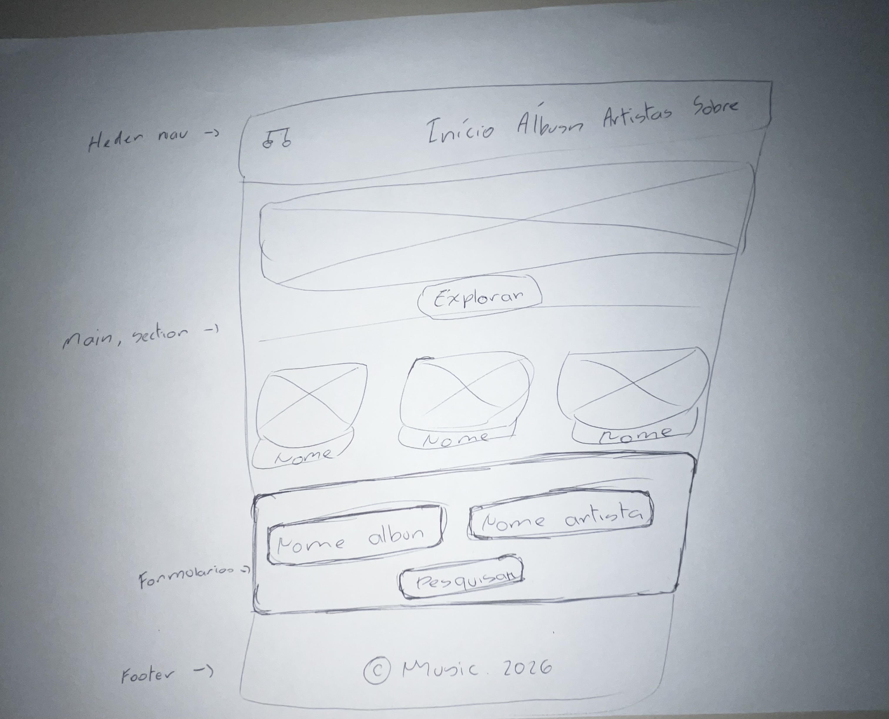
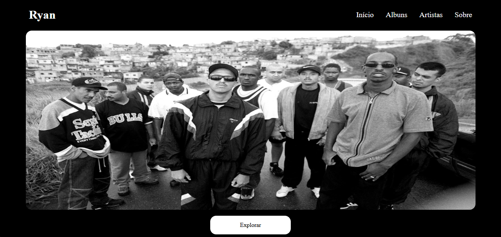
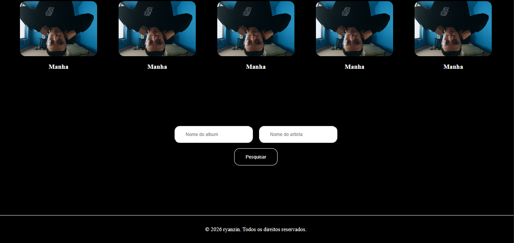

1. Dados básicos

Nome: Ryan Gabriel
Matrícula: 929807
Proposta escolhida: Coleções e Itens

Descrição do projeto:
É uma aplicação web voltada para a exploração e organização de álbuns musicais. A aplicação apresenta álbuns e seus respectivos artistas, permitindo futuramente consultar suas faixas e buscar diferentes conteúdos musicais.

2. Wireframe

O wireframe abaixo representa o planejamento inicial da página inicial.

3. Home-page

Abaixo está o resultado da implementação da Home-page utilizando HTML e CSS.

